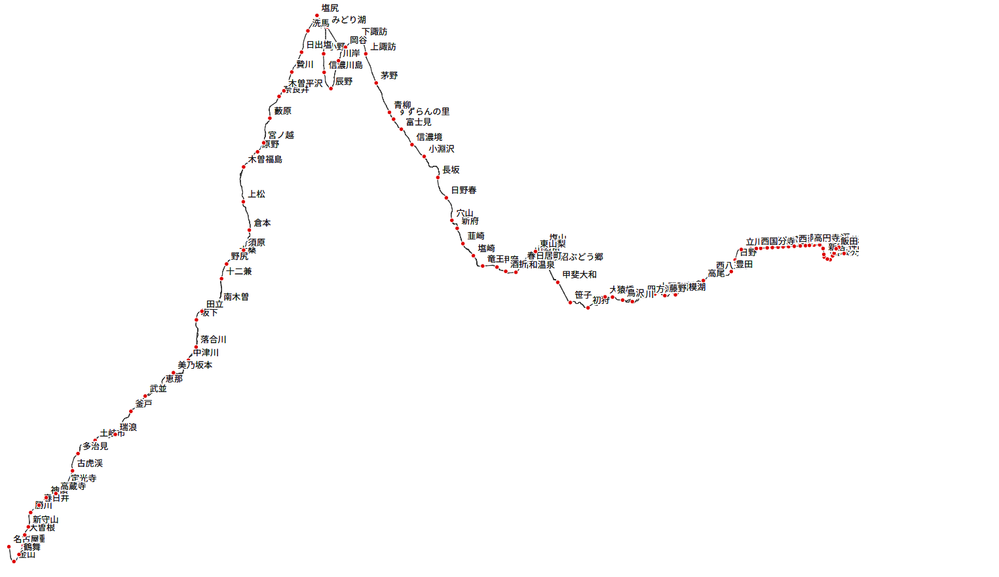

# CLI-Geographic-Calculation

## 実行方法

基本的な使い方
SQL Like な記法で国土データの svg レンダリング結果が要求できます。

```
curl -sS \
  --get \
  --data-urlencode "query=SELECT * FROM rail WHERE company = '四国旅客鉄道' AND line IN ('鳴門線')" \
  https://cli-geographic-calculation.vercel.app/api/2023/rail
```

会社を複数指定する

```
curl -sS \
  --get \
  --data-urlencode "query=SELECT * FROM rail WHERE company IN ('東急電鉄' , '小田急電鉄')"  \
  https://cli-geographic-calculation.vercel.app/api/2023/rail/svg -o tokyu-odakyu.svg
```

会社を複数指定する + 路線を指定する

```
curl -sS   --get   --data-urlencode "query=SELECT * FROM rail WHERE company IN ('東日本旅客鉄道' , '東海旅客鉄道' ) AND line = '中央線'"   https://cli-geographic-calculation.vercel.app/api/2023/rail/svg -o chuo.svg
```


出力 svg の例（テスト版）

## 権利情報

### 出典

「国土数値情報（鉄道 データ）」（国土交通省）[国土数値情報（鉄道 データ）](https://nlftp.mlit.go.jp/ksj/gml/datalist/KsjTmplt-N02-2022.html)を加工して作成

## 備考

（任意）
本ソフトウェアを用いて公開した動画の概要欄に「しおまち （ https://twitter.com/ShioPy0101 のソフトウェアを用いて地理情報を用いたアニメーションを作成しました」的なことを書いてくれると、うれしいです。
